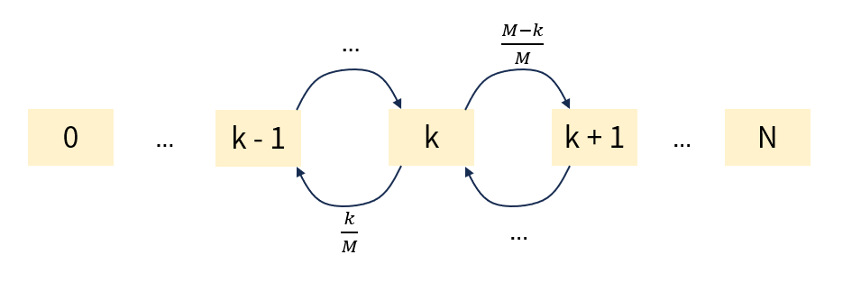

# Problem Description

*Community difficulty rating: 5 kyu (medium)*

"Blind box match" is a game where the host opens blind boxes to reveal random gifts. There are $M$ types of gifts, and $N$ empty slots on the table, each holding at most one gift. Each round, the host opens a blind box and places the gift into an empty slot. If a gift of the same type is already on the table, then all gifts of that type are removed (including the newly placed one). The game continues until all slots are filled with gifts of distinct types. At that point, the player keeps every gift that was opened during the game (including those that were later removed). Gift types are drawn uniformly at random. The question is: what is the expected total number of gifts the player receives in one game?

Below is an example with $N = 3$ slots and $M = 4$ gift types: A, B, C, D.

```text
-> Initially all slots are empty:
_ _ _

-> Host opens a blind box, gets gift A:
A _ _

-> Host opens a blind box, gets gift B:
A B _

-> Host opens a blind box, gets gift A:
A B A

-> A matches, all A's are removed:
_ B _

-> Host opens a blind box, gets gift C:
C B _

-> Host opens a blind box, gets gift D:
C B D

No empty slots remain. The player received 5 gifts.
```

**Input:** number of slots $N$ and number of gift types $M$. Guaranteed: $1 \leq N \leq M \leq 31$

**Output:** a floating-point number, the expected total number of gifts received.


# Solutions

## Linear Equations




Consider the game mechanics. Since duplicate gifts are removed as soon as they appear, the gifts on the table are always of distinct types. Therefore, we don't need to track the count of each gift type — tracking the number of distinct gift types currently on the table is sufficient. We can model this as a Markov chain, where the state is the number of distinct gifts on the table. Each time a blind box is opened, a state transition occurs. When there are $k$ gifts on the table, there is a $k/M$ probability of drawing an existing type, which removes the duplicates and reduces the count by 1. Conversely, there is a $(M-k)/M$ probability of drawing a new type, increasing the count by 1. The process stops upon reaching state $N$, i.e., all slots are filled.

How does this relate to the total number of gifts received? Each time a gift is placed on the table, the gift count increases by 1. Therefore, the number of state transitions is exactly the total number of gifts received. In other words, what we need is the expected hitting time from state 0 to state $N$ in this Markov chain.

Define $h_k$ as the expected number of remaining blind boxes to open before reaching the terminal state $N$, given that there are currently $k$ distinct gifts on the table. Our goal is to compute $h_0$. The state transition equations are as follows. Each transition consumes one step, so we add 1 and multiply by the respective transition probabilities:

$$
h_k = 1 + \frac{k}{M}h_{k-1} + \frac{M-k}{M}h_{k+1} \\
$$

This looks like a recurrence suitable for dynamic programming, but state transitions go both ways: computing $h_k$ requires both $h_{k-1}$ and $h_{k+1}$, which in turn depend on $h_k$. This means we cannot solve it via DP recurrence. Instead, we solve the following system of linear equations:

$$
\begin{cases}
h_N = 0 \\
h_0 - h_1 = 1 \\
h_k -\frac{k}{M}h_{k-1} - \frac{M-k}{M}h_{k+1} =1
\qquad (1 \le k < N)
\end{cases}
$$

```python
import numpy as np

def blind_box_match(n, m):
    A, b = [[1, -1] + [0]*(n-1)], [1]

    for k in range(1, n):
        row = [0]*(n+1)
        row[k-1:k+2] = [-k/m, 1, -(m-k)/m]
        A.append(row)
        b.append(1)

    A.append([0]*n + [1])
    b.append(0)

    return np.linalg.solve(A, b)[0]
```

Alternatively, we can use the standard formula for the expected hitting time of a Markov chain. Let $\mathbf h$ be the vector of expected hitting times, $Q$ be the transition submatrix after removing the absorbing state $N$ (where $Q_{ij}=P(X_{t+1}=j\mid X_t=i)$), and $\mathbf 1$ be the all-ones column vector:

$$
(I-Q) \mathbf h=\mathbf 1
$$

```python
import numpy as np

def blind_box_match(n, m):
    Q = np.zeros((n, n))
    if n > 1:
        Q[0][1] = 1
        
    for k in range(1, n):
        Q[k][k-1] = k / m
        if k + 1 < n:
            Q[k][k+1] = (m-k) / m
            
    return np.linalg.solve(np.eye(n) - Q, np.ones(n))[0]
```


## Difference of Expectations

We can define $z_k = h_k - h_{k+1}$ to simplify the computation. The meaning of $z_k$ becomes the expected time to go from state $k$ to state $k+1$ for the first time. The target value $h_0$ can then be expressed as:

$$
h_0 = \sum_{k=0}^{N-1} z_k
$$

From this interpretation, we can derive a recurrence for $z_k$:

$$
z_k = 1 + \frac{M-k}{M}\cdot 0 + \frac{k}{M}(z_{k-1} + z_k)
$$

After taking one step from state $k$, if we directly reach $k+1$ (with probability $\frac{M-k}{M}$), no extra steps are needed. With probability $\frac{k}{M}$, however, we fall back to $k-1$, in which case we must first go from $k-1$ to $k$, and then from $k$ to $k+1$. Rearranging:

$$
z_k = \frac{M + k z_{k-1}}{M-k}
$$

Now $z_k$ depends only on $z_{k-1}$. This elegant property allows us to compute all $z$ values via dynamic programming recurrence. The sum of all $z$ values gives $h_0$.

```python
def blind_box_match(n, m):
    z = 1
    ans = z

    for k in range(1, n):
        z = (m + k * z) / (m - k)
        ans += z

    return ans
```
