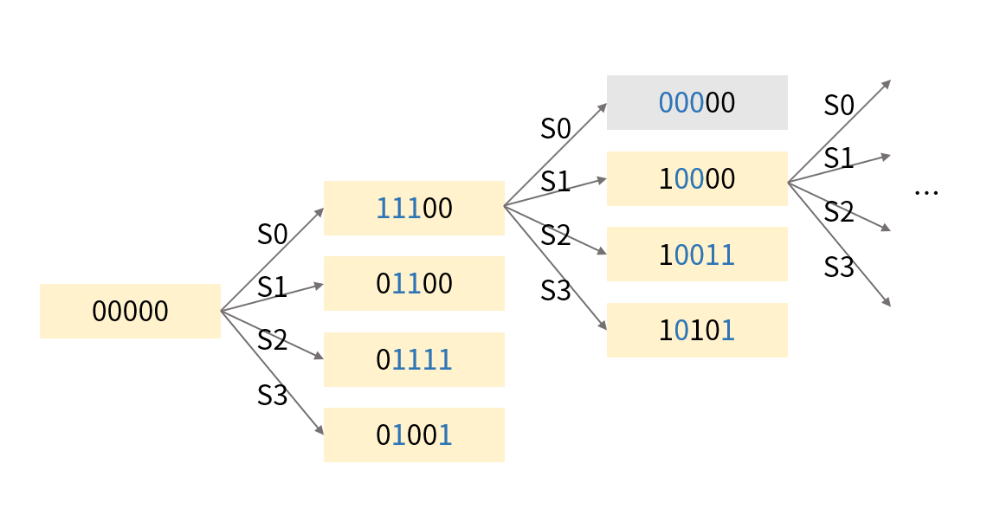
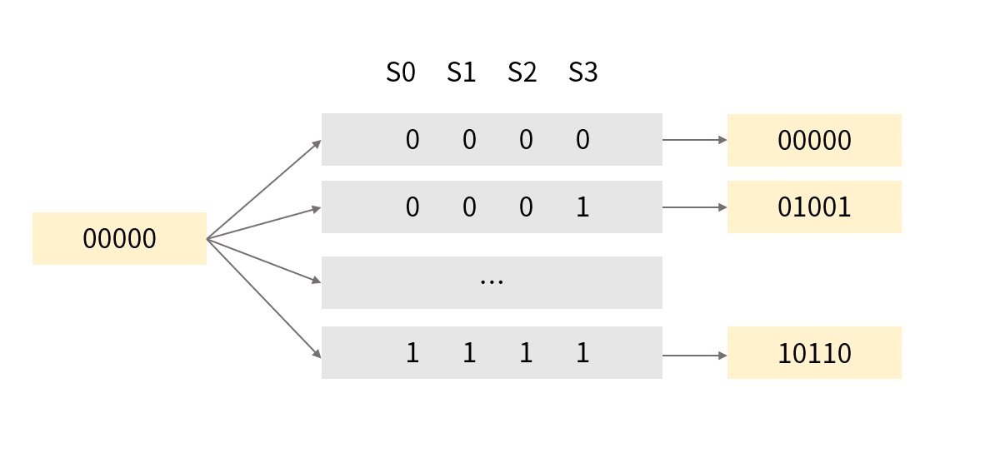
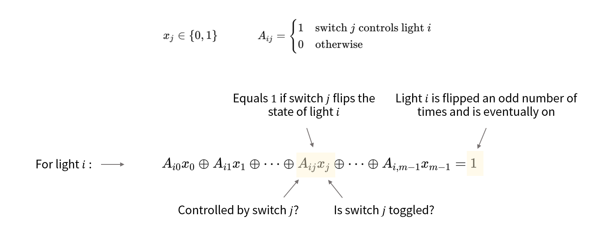

# Problem Description

*Community difficulty rating: 5 kyu (medium)*

There are $N$ lights in a room, numbered $0$ through $N-1$. Initially, all lights are off, and you want to turn them all on.

There are $M$ switches in the room, numbered $0$ through $M-1$. Each switch controls a subset of lights. Toggling a switch flips the state of every light it controls (i.e., off becomes on, on becomes off).

Write a program to determine whether there exists a sequence of switch toggles such that all lights end up on.

The input is a two-dimensional array representing the switch-to-light mapping. The first dimension indexes switches, and the second lists the light indices that switch controls. The output should be whether there is a way to turn all lights on (return true / false).

Constraints:

- $1 \le \min(N, M) < 16$
- $\max(N, M) < 32$

For example, with 5 lights and 4 switches, the mapping is:

```text
[
  [0, 1, 2],    // switch 0 controls lights 0, 1, 2
  [1, 2],       // switch 1 controls lights 1, 2
  [1, 2, 3, 4], // switch 2 controls lights 1, 2, 3, 4
  [1, 4]        // switch 3 controls lights 1, 4
]
```

Initial state:

```text
0 0 0 0 0
```

Toggle switch 0:

```text
1 1 1 0 0
```

Toggle switch 2:

```text
1 0 0 1 1
```

Toggle switch 1:

```text
1 1 1 1 1
```

All lights are now on, so return:

```text
true
```


# Solutions

## BFS / DFS



It's natural to approach this with search. Taking the example above, we can start from $00000$ and treat each branch as toggling one switch. For each newly generated state, repeat the process until all reachable states have been explored.

Two common traversal methods are BFS and DFS. Compress each light configuration into a single integer and use bitwise XOR to simulate toggling a switch. Start from initial state $0$, try toggling each switch, and proceed to any unvisited new states until the target state $2^n-1$ is found or all states are exhausted.

But there's a catch — in theory, there can be up to 32 lights, which means at most $2^{32}$ (over $10^9$) states. Traversing all of them would obviously time out. So why does a plain search still work?



Because not all of those states are reachable. Whether using BFS or DFS, we never revisit already-explored states. From the lights' perspective, there are at most $2^N$ states to explore, but the same is true from the switches' perspective. Note a key property: toggling a switch more than once is pointless, since two toggles cancel each other out. Therefore, each state in the search tree also implicitly encodes which switches have been toggled — each switch is either toggled or not. So the search tree contains at most $2^M$ states. Combining both constraints, the number of states actually visited is bounded by $2^{\min(N, M)}$. For each new state, we do at most one round of expansion, giving a complexity of $O(M \cdot 2^{\min(N, M)})$.

BFS uses a queue: start from initial state $0$, dequeue states one by one, try toggling each switch, and enqueue any unvisited new states.

```python
from collections import deque

# n: number of lights
# corresponding_lights_list:
#   corresponding_lights_list[i] = lights controlled by switch i
def light_switch(n, corresponding_lights_list):
    switch_masks = []
    for lights in corresponding_lights_list:
        mask = 0
        for light in lights:
            mask |= (1 << light)
        switch_masks.append(mask)
    start = 0
    target = (1 << n) - 1
    if start == target:
        return True

    queue = deque([start])
    visited = {start}
    while queue:
        state = queue.popleft()
        for switch_mask in switch_masks:
            next_state = state ^ switch_mask
            if next_state == target:
                return True
            if next_state not in visited:
                visited.add(next_state)
                queue.append(next_state)

    return False
```

DFS replaces the queue with a stack — use `list` and `pop()`. **Do not use recursion**: the state space can be deep enough to trigger Python's recursion limit.

```python
# DFS: only the differing parts — everything else is identical
stack = [start]
visited = {start}
while stack:
    state = stack.pop()
    if state == target:
        return True
    for switch_mask in switch_masks:
        next_state = state ^ switch_mask
        if next_state not in visited:
            visited.add(next_state)
            stack.append(next_state)
```


## Deduplication Enumeration

Enumerating switch states is also viable. For each switch, there are two choices — toggle or don't toggle — so with each new switch added, we can expand the existing state set. Since a set automatically deduplicates, each light configuration is kept only once, and the number of states maintained never exceeds $\min(2^N, 2^M)$. Each round expands every state in the set, for $N$ rounds total, giving a complexity of $O(N \cdot 2^{\min(N, M)})$.

```python
# n: number of lights
# corresponding_lights_list:
#   corresponding_lights_list[i] = lights controlled by switch i
def light_switch(n, corresponding_lights_list):
    result = {0}
    for s in corresponding_lights_list:
        result |= {x ^ sum(1 << x for x in s) for x in result}
    return (1 << n) - 1 in result
```

Deduplication is essential. Without it, the algorithm degenerates into a brute-force enumeration over switch combinations and will time out.


## GF(2) Gaussian Elimination

Let matrix $A$ represent the relationship between lights and switches, where $A_{ij}$ indicates whether switch $j$ controls light $i$. We seek a vector $\mathbf{x}$ indicating which switches to toggle, where $x_j$ denotes whether switch $j$ is toggled. Then for any light $i$, we can write the following linear equation:



This linear equation states that for light $i$, we need to find a toggle scheme that turns it on. The same applies to all lights, so we simply need to solve the linear system $A\mathbf{x} = \mathbf{1}$.

Solving a system of XOR-linear equations is done via $\mathrm{GF}(2)$ Gaussian elimination, with a complexity of $O(NM \min(M, N))$.

```python
# n: number of lights
# corresponding_lights_list:
#   corresponding_lights_list[i] = lights controlled by switch i

def light_switch(n, corresponding_lights_list):
    m = len(corresponding_lights_list)
    m1 = [[1 if i in corresponding_lights_list[j] else 0 for j in range(m)] for i in range(n)]
    m2 = [[1] for i in range(n)]
    
    rank = 0
    for i in range(m):
        j = next((j for j in range(rank, n) if m1[j][i]), n)
        if j < n:
            if j != rank:
                m1[rank] = [a ^ b for a, b in zip(m1[rank], m1[j])]
                m2[rank] = [a ^ b for a, b in zip(m2[rank], m2[j])]
            for k in range(n):
                if k != rank and m1[k][i]:
                    m1[k] = [a ^ b for a, b in zip(m1[rank], m1[k])]
                    m2[k] = [a ^ b for a, b in zip(m2[rank], m2[k])]
            rank += 1
    
    return all(1 in m1[i] for i in range(n) if m2[i][0])
```
